# blog architecture

Java native based blog powered by Quarkus over Qute templating engine.

```mermaid
flowchart LR
    blog(blog):::main--->contentful(contentful.com):::external
    blog--->gravatar(gravatar.com):::external
    blog--->google(google.com):::external
    blog--->database[(postgres at aivencloud.com)]:::postgres
    qute[/qute/]:::internal---blog
    classDef external fill:#480593
    classDef internal fill:#a256f8
    classDef postgres fill:#30648B
    classDef main fill:#23123B
```



## build guide

How the application can be built is to be found [here](./doc/build.md).

## environment variables

```shell
GDEVXY_DATABASE_USERNAME=
GDEVXY_DATABASE_PASSWORD=
GOOGLE_CAPTCHA_SECRET=
GRAVATAR_API_KEY=
CONTENTFUL_CDA_TOKEN=
CONTENTFUL_CMA_TOKEN=
```
