# blog

Java native based blog powered by Quarkus over Qute templating engine.

```mermaid
flowchart LR
    blog(blog):::main--->contentful(contentful):::external
    blog--->gravatar(gravatar):::external
    qute:::internal---blog
    classDef external fill:#480593
    classDef internal fill:#a256f8
    classDef main fill:#23123B
```



## Building guide

How the application can be built is to be found [here](./doc/build.md).

## Environment variables

### Contentful

Project is based on the default Contentful blog starter [template](https://www.contentful.com/starter-templates/nextjs-blog/).

```shell
# Content Delivery Access Token
export CONTENTFUL_CDA_TOKEN=...
# Content Preview Access Token
export CONTENTFUL_CPA_TOKEN=...
``` 

### Gravatar

In order to powered the `/about` page a gravatar API key is required.

```shell
export GRAVATAR_API_KEY=...
```
